# Subspace projections

----

### Topics

   - Dimensionality
   - PCA
   - Manifold learning
   - Digits example

----

### Design matrix: X

`$$ \begin{bmatrix}
   y_1 \\
   y_2 \\
   \vdots \\
   y_n
   \end{bmatrix}
   = f \left( \begin{bmatrix}
     x_{11} & x_{12} & x_{13} & \dots  & x_{1p} \\
     x_{21} & x_{22} & x_{23} & \dots  & x_{2p} \\
     \vdots & \vdots & \vdots & \ddots & \vdots \\
     x_{n1} & x_{n2} & x_{n3} & \dots  & x_{np}
   \end{bmatrix} \right) $$`

 - Number of features = $p$
 - Number of samples = $n$
 - Dimensionality = <span> number of features </span> <!-- .element class="fragment" -->


----

<!-- .slide: data-background="#DDDDDD" color="black" -->

### Building of the design matrix

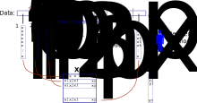 <!-- .element style="width=300" -->


* The purpose of feature extraction is to capture relevant properties of the samples into variables.
<!-- .element class="fragment" -->

----

- Sometimes the Design matrix has too many features, $p$
- Problems expected when $p>n$
- Then multivariate methods needs to be used
- But subspace projection may be another solution 

---

### Principal component analysis, PCA

`$$
    \PP_{n\times p'} = \XX_{n\times p} ~ \EE_{p\times p'},
$$`

- $\EE$ is a matrix of eigenvectors in columns <!-- .element class="fragment" -->
- $\PP$ is a matrix X in a coordinates spanned by the eigenvectors <!-- .element class="fragment" -->
- Some least important eigenvectors can be left out $p'<p$ to achieve a reduced subspace <!-- .element class="fragment" -->
 
----

### Singular value decomposition

`$$
   \XX = \UU \SS \VV^T,
$$`

- $\SS$ is the diagonal matrix of singular values (eigenvalues) 
- $s_i$ and columns of $\VV$ are principal directions/axis (or eigenvectors).

----

### How to do it in Python

```Python [1|4|5|8-11|12]
from sklearn.decomposition import PCA

# Perform PCA decomposition
pca=PCA(n_components=2)
Xp=pca.fit_transform(Xs)

# Plot the original data and transformed data side by side
fig, (ax1, ax2)=plt.subplots(nrows=1, ncols=2, figsize=(12,5))
plotData(Xs, ax1, xlab='X1', ylab='X2', title='Original data')
plotData(Xp, ax2, xlab='PC 1', ylab='PC 2', title='PCA', 
    noline=True)
pca.explained_variance_ratio_

```

----

### Result of PCA for linear data

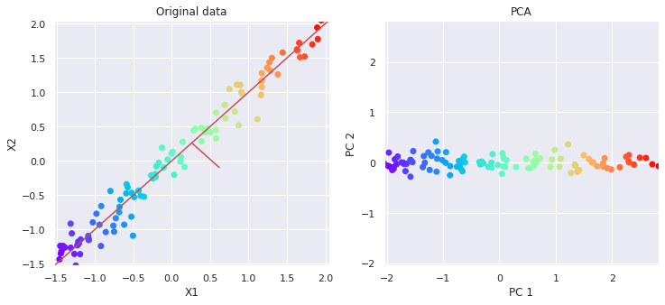

----

### Result of PCA for non-linear data

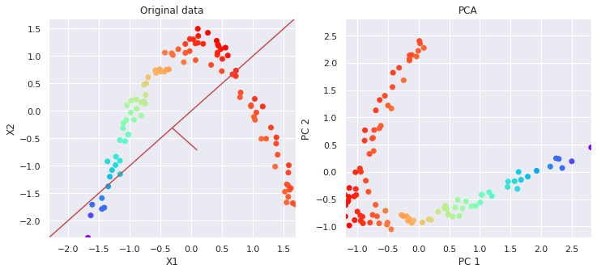

- Obviously linear PCA does not fit to non-linear data <!-- .element class="fragment" -->

---


### What is the dimensionality of this data?

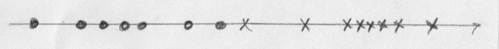

- Data is along one line, so it is 1D <!-- .element class="fragment" -->
- It can be presented with only one feature <!-- .element class="fragment" -->


----

### What is the dimensionality of this data?

<div id="left">

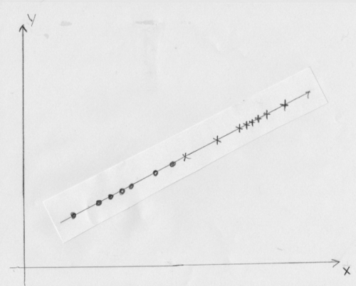 

</div>

<div id="right">

- Data is still along one line, so it is 1D <!-- .element class="fragment" -->
- A linear transformation is needed to desribe it with only one feature <!-- .element class="fragment" -->

</div> 

----

### What is the dimensionality of this data?

<div id="left">

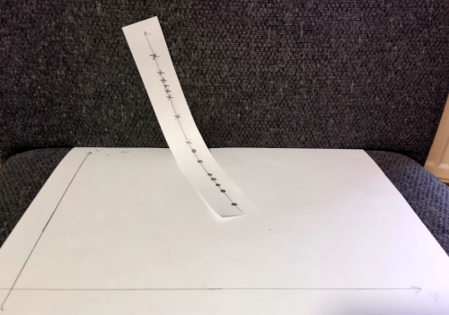 

</div>

<div id="right">

- Data is still along one curved line, so it is kind of 1D <!-- .element class="fragment" -->
- A non-linear transformation may help to desribe it with only one feature <!-- .element class="fragment" -->

</div>

---

### Manifold learning

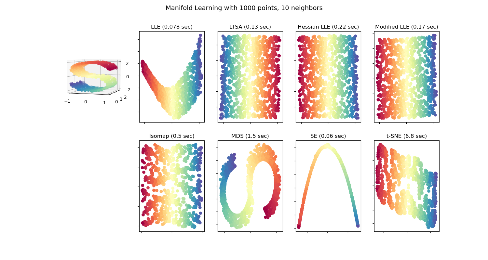

- Unfolds the sheet to lower dimensional space <!-- .element class="fragment" -->

----


### Unfolding

- Dimensionality = number of features <!-- .element class="fragment" -->
- PCA and all nonlinear unfolding methods can be used to reduce the dimensionality <!-- .element class="fragment" -->
- The relationships between samples (neighborhood) needs to be preserved during dimensionality reduction
<!-- .element class="fragment" -->
    - The relative distance between samples needs to be kept
    - Samples which were  close to each other as still close to each other

----

### t-SNE

#### T-distributed Stochastic Neighbor Embedding.

 - manifold method for unfolding nonlinear data
 - often initialized using PCA
 - slow and therefore may require PCA to preprocess the
   data to lower dimensionality first
 - non-reversible: Cannot go reduced dimensions to original


----


```Python [1|2|3|6-10]
from sklearn.manifold import TSNE
tsne=TSNE(n_components=2)
Xp=tsne.fit_transform(Xs)

# Plot the original data and transformed data side by side
fig, (ax1, ax2)=plt.subplots(nrows=1, ncols=2, figsize=(12,5))
plotData(Xs, ax1, xlab='X1', ylab='X2', title='Original data')
plotData(Xp, ax2, xlab='t-SNE component 1', 
   ylab='t-SNE component 2', title='t-SNE', noline=True, 
   fs=False)
```

----

### Result of t-SNE for non-linear data


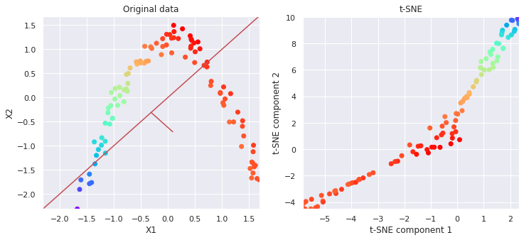

- t-SNE can already unfold it better <!-- .element class="fragment" -->


---

### Digits classification


- 1797 samples (n)
- 64 features (p), 8x8 pixels
- $\XX_{1797,64}$

----

### PCA

```Python
pca = PCA(32)  # project from 64 to 32 dimensions
projected = pca.fit_transform(digits.data)
```

<div id="left">

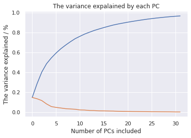

</div>

<div id="right">

 - What is the optimal number of principal components?<!-- .element class="fragment" -->
 - What is the "true" dimensionality of the data?<!-- .element class="fragment" -->

</div>

----

### PCA results

<div id="left">

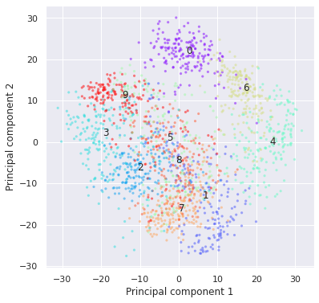

</div>

<div id="right">

 - Can you easily separate the digits from each other in 2D? <!-- .element class="fragment" -->
 - 2D only explain 29% of the variance<!-- .element class="fragment" -->
 - They are probably better separable for example in 12 dimensional space<!-- .element class="fragment" -->
 
</div>
 
----

### ISOMAP results


```Python
from sklearn.manifold import Isomap
isomap=Isomap(n_components=2, n_neighbors=30)
Y=isomap.fit_transform(digits.data)
```

<div id="left">


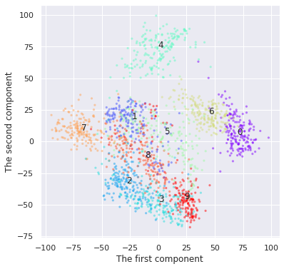

</div>

<div id="right">

 - Is the result better than PCA <!-- .element class="fragment" -->
 - Are digits separable already?<!-- .element class="fragment" -->
 - They are yet better separable in higher dimensional space<!-- .element class="fragment" -->
 
</div>
 
----

### t-SNE results

```Python
from sklearn.manifold import TSNE
tsne=TSNE(n_components=2)
Y=tsne.fit_transform(digits.data)
```

<div id="left">

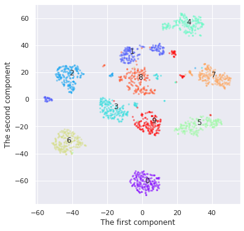

</div>

<div id="right">

 - Can you easily separate the digits from each other in 2D? <!-- .element class="fragment" -->
 - t-SNE could separate them pretty well already <!-- .element class="fragment" -->
 - But sometimes it can find artificial clusters <!-- .element class="fragment" -->
 
</div>
 
----

### Conclusion - PCA

- PCA is a powerfull method for transforming data into low dimensional subspace<!-- .element class="fragment" -->
- PCA learns linear dependences between variables (correlation) and removes it, so that projected variables are uncorrelated<!-- .element class="fragment" -->
- PCA transformation can be reversed, and the transformed data converted back to the original domain <!-- .element class="fragment" -->
- If dependencies between variables is non-linear, then PCA cannot model it efficiently, and more components are needed<!-- .element class="fragment" -->

----

### Conlusion - Manifold learning

- Manifold learning methods, such as  and  can learn also non-linear dependencies producing lower dimensional subspace for presenting data<!-- .element class="fragment" -->
  - Multi-Dimensinal Scaling (MDS)
  - Isomap
  - Locally Linear Embedding (LLE)
  - t-distributed Stochastic Neighborhood Embedding (t-SNE)
- They keep the neighborhood information. <!-- .element class="fragment" -->
  - The samples which were close to each other are also close after projection.

----

### The end


<style>
#bright {
  color: deeppink;
}
#left {
    margin: 10px 0 15px 20px;
    text-align: center;
    float: left;
    z-index:-10;
    width:48%;
    font-size: 0.85em;
    line-height: 1.5;
}
#right {
    margin: 10px 0 15px 0;
    float: right;
    text-align: center;
    z-index:-10;
    width:48%;
    font-size: 0.85em;
    line-height: 1.5;
}

#dark_back {
  background-color: rgba(0, 0, 0, 0.9);
  color: #000;
  padding: 20px;
}

#white_back {
  background-color: rgba(1, 1, 1, 0.9);
  color: black;
  padding: 20px;
}
</style>
<link rel="stylesheet" href="plugin/highlight/monokai.css">
<link rel="stylesheet" href="plugin/chalkboard/style.css">
<!-- .slide: data-background="figures/uwrocks.png" -->
